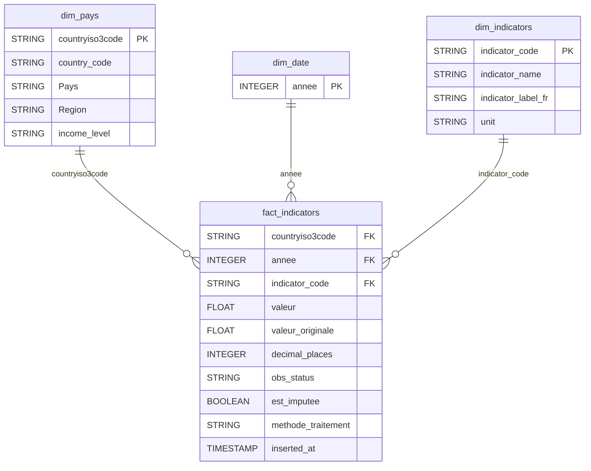

# World Bank Project - Analyse du développement des pays

Projet d'analyse des différences de développement entre les pays à partir des données de la Banque mondiale.

Les données économiques, démographiques, sociales, éducatives et environnementales sont récupérées depuis l'API World Bank, stockées dans BigQuery et transformées avec dbt.

Un modèle de Machine Learning Random Forest permet également de prédire la catégorie de revenu d'un pays à partir de 7 indicateurs. Les données et les résultats des prédictions sont visualisés dans Power BI.

L'utilisateur type identifié lors du Design Thinking est Patrick, responsable de programme dans une ONG internationale. Il doit régulièrement consulter des données socio-économiques afin de préparer des rapports, comparer plusieurs pays et identifier les zones pouvant nécessiter une intervention prioritaire.


## Prérequis

- Python 3.12.10
- Google BigQuery
- dbt Core
- scikit-learn
- Git / GitHub
- GitHub Actions
- Power BI Desktop
- Une clé de service Google Cloud pour accéder à BigQuery


## Installation

Installer les dépendances du projet :

```bash
uv sync
```

Configurer la clé de service Google Cloud et les variables d'environnement nécessaires pour accéder à BigQuery.

Les fichiers contenant des informations sensibles, comme `.env` et la clé de service Google Cloud, ne doivent pas être envoyés sur GitHub.


## Utilisation

Pour lancer le pipeline complet :

```bash
python run_pipeline.py
```

Le pipeline permet de :

- récupérer les données depuis l'API de la Banque mondiale ;
- charger les données dans BigQuery ;
- exécuter les transformations dbt ;
- mettre à jour les données utilisées pour l'analyse ;
- calculer les nouvelles prédictions de Machine Learning ;
- enregistrer les prédictions dans BigQuery.

Le pipeline peut également être exécuté automatiquement avec GitHub Actions.


## Structure du projet

- `load_data.py` : récupération et chargement des données depuis l'API de la Banque mondiale
- `run_pipeline.py` : orchestration du pipeline (ingestion + dbt + prédictions)
- `entrainer_modele.py` : entraînement et évaluation du modèle de Machine Learning
- `predict.py` : génération des prédictions
- `pipeline.pkl` : modèle de Machine Learning utilisé pour les prédictions
- `models/` : modèles et transformations dbt
- `models/staging/` : préparation des données brutes
- `models/marts/` : tables finales utilisées pour l'analyse et le Machine Learning
- `tests/` : tests de qualité des données
- `dbt_project.yml` : configuration du projet dbt
- `requirements.txt` : dépendances Python du projet
- `.github/workflows/` : automatisation du pipeline avec GitHub Actions
- `README.md` : documentation du projet

## Power BI

Power BI est utilisé pour analyser et visualiser les données et les résultats du projet.

Le tableau de bord permet notamment :

- d'avoir une vue d'ensemble du développement mondial ; 
- de comparer les pays, les régions;
- d'analyser l'évolution des indicateurs dans le temps ;
- d'étudier les indicateurs économiques, démographiques, sociaux, éducatifs et environnementaux ;
- de filtrer les résultats par pays, année et région ;
- d'analyser les relations entres certains facteurs avec le niveau de développement des pays ;
- de détailler les 16 indicateurs des pays et territoires;
- de consulter les prédictions du modèle de Machine Learning ;
- de comparer les catégories de revenu réelles et prédites ;
- d'afficher la matrice de confusion ;
- de consulter le résultat des prédictions pays par pays.


## Machine Learning

Le projet utilise un modèle de classification supervisé: Random Forest.

Il permet de prédire la catégorie de revenu d'un pays parmi les quatre catégories de revenu de la Banque mondiale :

- Low income
- Lower-middle income
- Upper-middle income
- High income

Le modèle utilise 7 features :

- espérance de vie ;
- dépenses de santé ;
- scolarisation secondaire ;
- dépenses publiques d'éducation ;
- taux de natalité ;
- émissions de CO₂ par habitant ;
- accès à l'électricité.

Pour l'évaluation du modèle :

- entraînement : données de 2015 à 2021 ;
- test : données de 2022 ;
- accuracy obtenue sur le test 2022 : 89,1 %.

Le modèle final utilisé en production est entraîné sur les données disponibles de 2015 à 2022.

Il permet ensuite de produire des prédictions pour 2023, 2024, 2025 et les années suivantes.

Les nouvelles prédictions sont recalculées lors de l'exécution du pipeline lorsque de nouvelles données deviennent disponibles.

## Sources de données

Les données proviennent de l'API publique de la Banque mondiale (World Bank API). Le pipeline vérifie tous les matins la disponibilité de nouvelles données.

Il récupère les données automatiquement puis les stocke dans Google BigQuery.

La granularité principale des données est :

1 ligne = 1 pays + 1 année + 1 indicateur + 1 valeur

Les données les plus récentes peuvent être incomplètes, car certains indicateurs sont publiés avec un décalage dans le temps.


## Stockage et transformation des données

Les données brutes récupérées depuis l'API sont stockées dans Google BigQuery.

Les transformations sont réalisées avec dbt afin d'obtenir des données propres et exploitables.

Le modèle de données comprend notamment :

- une dimension pays ;
- une dimension date ;
- une dimension indicateurs ;
- une table de faits contenant les valeurs des indicateurs ;
- une table contenant les features utilisées pour le Machine Learning.

Des tests dbt permettent également de contrôler la qualité des données.

## Schéma de la base de données

Les données destinées à l'analyse sont organisées selon un modèle en étoile.

La table de faits `fact_indicators` contient les valeurs des indicateurs par pays et par année. Elle est reliée aux dimensions `dim_pays`, `dim_date` et `dim_indicators`.

Les relations entre les tables de dimensions et la table de faits sont de type un-à-plusieurs (1:N).



### Relations

- `dim_pays` → `fact_indicators` : relation 1:N via `countryiso3code`
- `dim_date` → `fact_indicators` : relation 1:N via `annee`
- `dim_indicators` → `fact_indicators` : relation 1:N via `indicator_code`

Chaque ligne de `fact_indicators` correspond à la valeur d'un indicateur pour un pays et une année.

## Automatisation

Le pipeline est automatisé avec GitHub Actions.

Lors d'une exécution, le pipeline :

1. récupère les données disponibles depuis l'API de la Banque mondiale ;
2. charge les nouvelles données dans BigQuery ;
3. exécute les transformations dbt ;
4. prépare les données nécessaires au Machine Learning ;
5. recalcule les prédictions à partir des données disponibles ;
6. met à jour la table de prédictions dans BigQuery.

Le modèle de Machine Learning n'est pas réentraîné automatiquement à chaque exécution du pipeline.


## Limites du projet

Certaines données récentes de la Banque mondiale peuvent être manquantes ou publiées avec retard.

La qualité des prédictions dépend donc de la disponibilité des indicateurs utilisés par le modèle.

Lorsqu'une catégorie réelle n'est pas encore disponible, la prédiction ne peut pas encore être évaluée et reste indiquée comme "En attente".

Le modèle permet d'identifier des associations et des facteurs prédictifs, mais il ne permet pas à lui seul d'établir une relation de causalité entre les indicateurs et le niveau de développement d'un pays.


## Technologies utilisées

- Python
- World Bank API
- Google BigQuery
- dbt Core
- scikit-learn
- Git
- GitHub
- GitHub Actions
- Power BI


## Contact

Erika RASAMOELY
rav_erika@yahoo.fr

Projet réalisé dans le cadre de la formation Data Analyst - RNCP38616.